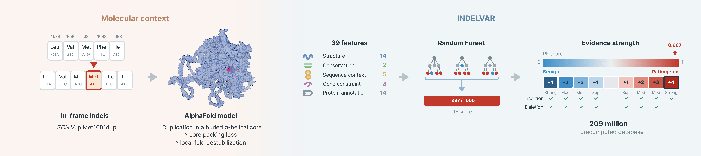

# INDELVAR (IN-frame inDEL VARiant pathogenicity predictor)

INDELVAR predicts the pathogenicity of in-frame indels (1-10 amino acids) with a random forest over 39 features, including AlphaFold-derived three-dimensional structural features. It returns a 0-1 pathogenic probability, calibrated separately for insertions and deletions to ACMG/AMP evidence strata under the ClinGen SVI framework. Each prediction also decomposes into four interpretable fold-destabilization mechanisms (core packing loss, secondary-structure break, hydrogen-bond loss, and hydrophobic core exposure).



## Model features (39)

- **Structure** (14): mean pLDDT, helix/sheet fraction, relative solvent accessibility, weighted contact number, contact density, bridging contacts, secondary-structure-element break and fraction affected, H-bond density, hydrophobic-exposure risk, helix-register preservation, local SS class, low-pLDDT region ([AlphaFold DB](https://alphafold.ebi.ac.uk/))
- **Conservation** (2): [phyloP100way](https://hgdownload.soe.ucsc.edu/goldenPath/hg38/phyloP100way/) (UCSC), [GERP](https://ftp.ensembl.org/pub/release-111/compara/conservation_scores/) (Ensembl)
- **Sequence context** (5): indel size (absolute and CDS-relative), indel type, local sequence entropy, distance to the nearest splice site
- **Gene constraint** (4): [pLI, LOEUF, missense-Z](https://gnomad.broadinstitute.org/data#v4-constraint) (gnomAD v4), CDS length
- **Protein annotation** (14): domain / repeat / PTM / disulfide / active-site context, subcellular localization ([UniProt](https://www.uniprot.org/))

## Usage: query by protein coordinate

> **Setup:** install the dependencies into your own environment first with `pip install -r requirements.txt` (the bare system `python3` lacks `pyarrow`, which the tools need to read the score tables).

INDELVAR is a MANE Select protein-coordinate resource. Get your variant's MANE consequence from [Ensembl VEP](https://github.com/Ensembl/ensembl-vep) (`--mane_select`) and look it up by gene (or MANE transcript) + HGVS p.:

```bash
python code/indelvar_lookup.py --gene CFTR --hgvsp p.Leu127dup            # score + tier + mechanisms
python code/indelvar_lookup.py --gene MLH1 --hgvsp p.Val612del --features # + the 39 features
```

Insertions are keyed by position and length only (the inserted-residue sequence is not modelled), so one record scores any in-frame insertion of a given size at a given junction. Everything runs offline (VEP `--offline` + local tables); no variant data leaves your machine.

For per-variant SHAP, score a prepared 39-feature table (the `--features` columns) with the shipped [`model/`](model/) to get the score, evidence tier, and signed feature-group attribution:

```bash
Rscript code/score_variants.R <features.tsv> <out.tsv> [del|ins]
```

## Performance

On an independent test set, INDELVAR reaches an AUROC of 0.925 (deletions 0.922, insertions 0.932). Its scores are calibrated separately per indel type to ACMG/AMP evidence strata under the ClinGen SVI local posterior-probability framework.

## Download

The precomputed scores and the 39-feature matrix for all ~209 million 1-10 aa in-frame indels across 19,053 MANE Select protein-coding genes are on Zenodo (large files): **[DOI: 10.5281/zenodo.21285600](https://doi.org/10.5281/zenodo.21285600)**.

| file | rows | description |
|---|---|---|
| `release_scores.parquet` / `.tsv.gz` | 209,211,495 | score, ACMG tier + points, four mechanism flags, per variant |
| `release_features.parquet` | 209,211,495 | the 39 model features (joins to `release_scores`) |

Place the downloaded tables in `data/` (or pass `--tables <dir>` to the lookup tool). The trained model is in this repository under [`model/`](model/); no download is needed for SHAP.

## Reproduce

[`code/WORKFLOW.md`](code/WORKFLOW.md) documents the full pipeline: building the cohorts and features, training the model, calibrating the cutoffs, and assembling the precomputed database.

## Citation

If you use INDELVAR in your research, please cite:

Ji E. "INDELVAR: Structure-based interpretation of in-frame indel pathogenicity." *bioRxiv* (2026). *(preprint; DOI pending submission)*

Calibration uses the ClinGen SVI local likelihood-ratio framework ([Pejaver et al. 2022](https://doi.org/10.1016/j.ajhg.2022.10.013)) with per-type evidence targets from [Abderrazzaq et al. 2026](https://doi.org/10.64898/2026.04.15.718599).

The precomputed scores and feature tables are archived at [doi:10.5281/zenodo.21285600](https://doi.org/10.5281/zenodo.21285600).
